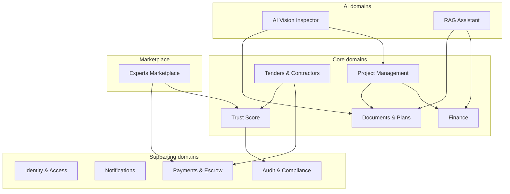
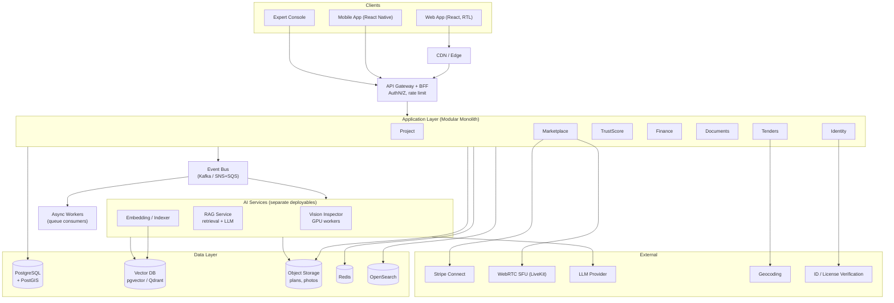
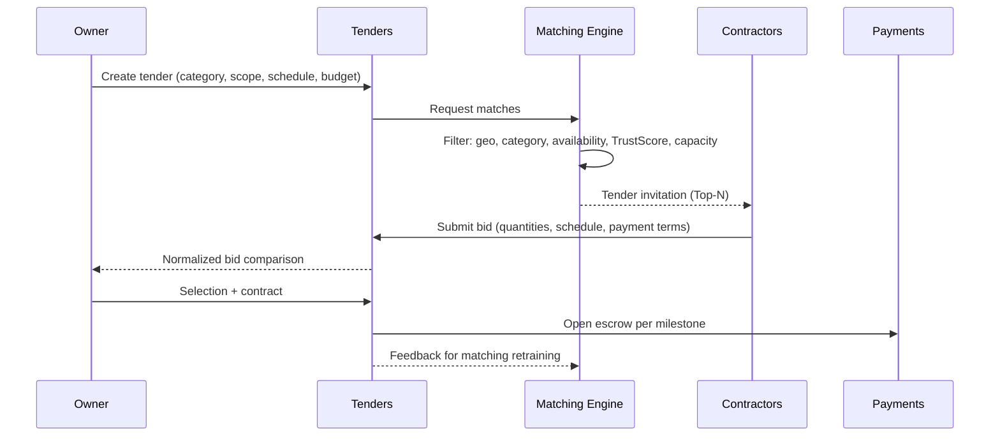
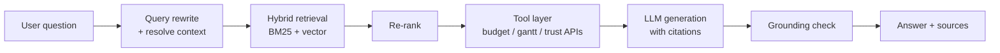
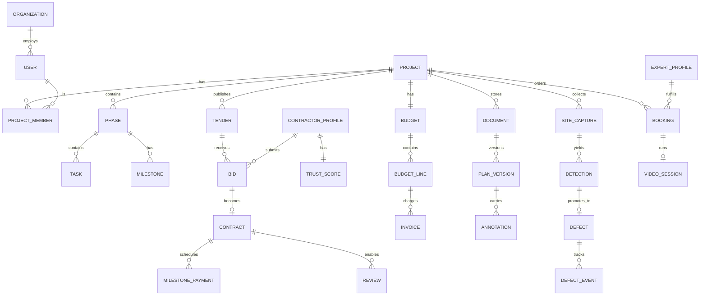

# BuildGuard — High Level Design

| | |
|---|---|
| **Version** | 0.1 (first draft) |
| **Date** | 2026-08-07 |
| **Status** | For review |
| **Audience** | Leadership, architecture, product, engineering |

---

## 1. Executive Summary

BuildGuard is a SaaS platform for managing and supervising residential construction projects. It connects
three parties — **homeowners / private developers**, **contractors and tradespeople**, and **licensed
inspectors and consultants** — around a single construction project, which is the central entity in the system.

The core differentiator is the **AI layer**: a computer-vision "virtual inspector" that compares field photos
against architectural plans, detects defects, deviations and safety hazards, and produces a report with
severity ranking and an estimated repair cost. Alongside it, a RAG chatbot answers questions grounded in the
documents of that specific project (contracts, plans, invoices).

This document defines the domain decomposition, the logical and physical architecture, the data model,
the key flows, the non-functional requirements, and a phased roadmap.

---

## 2. Goals and Non-Goals

### 2.1 Product Goals

| # | Goal | Success Metric (KPI) |
|---|---|---|
| G1 | Give the homeowner real control over budget and schedule without professional expertise | Reduction in average project budget overrun |
| G2 | Replace word-of-mouth referrals with data-driven contractor selection | % of projects where the contractor was selected through the platform tender |
| G3 | Provide continuous supervision at low cost | # of AI-detected defects confirmed by a human inspector |
| G4 | Produce trust that is hard to fake | % of verified reviews (contract + milestone) out of all reviews |
| G5 | Build a profitable two-sided service marketplace | Marketplace GMV, take-rate |

### 2.2 Technical Goals

* **Multi-tenant** and secure — data isolation at the project and organization level.
* **Modular monolith → services**: start as a modular monolith with sharp domain boundaries, allowing services to be extracted later.
* **AI as an isolated service** — ability to swap models/vendors without touching the business core.
* **Mobile-first for the field** — photo upload and offline-tolerant operation from the site.
* **RTL-first** — Hebrew as the default language, on a full i18n foundation.

### 2.3 Non-Goals (for now)

* No payroll or workforce attendance management for contractors.
* No CAD authoring/editing — viewing, measuring and annotating only.
* No replacement for a legally binding structural engineer sign-off — AI output is a **recommendation**, not an engineering approval.
* No support for industrial or infrastructure projects in v1 (residential only).

---

## 3. Users and Key Scenarios

### 3.1 Personas

| Persona | Motivation | Primary pain | Usage frequency |
|---|---|---|---|
| **Homeowner / private developer** | Build on budget and on time | Lack of expertise, lack of transparency | Daily |
| **Contractor / tradesperson** | Win quality jobs | Competing on price alone, cash flow | Daily during execution |
| **Inspector / engineer** | Monetize expertise in focused consultations | Wasted trips to site | On demand |
| **Platform operator** | Marketplace quality, fraud prevention | Fake reviews, disputes | Daily |

### 3.2 Key User Journeys

1. **Project setup**: homeowner defines a project → uploads plans → system proposes a phased timeline and a baseline budget based on type/size.
2. **Tender and selection**: publish a work package → algorithmic matching to contractors → bids → comparison → contract → escrow.
3. **Ongoing supervision**: contractor/homeowner uploads field photos → Vision Inspector analyzes → defect opened as an issue → assigned and tracked to closure.
4. **Financial question**: homeowner asks in chat "how much contingency is left if the plumber overruns by 12%?" → RAG pulls from the contract, invoices and budget → answer with cited sources.
5. **On-demand consultation**: book an inspector from the Marketplace → video call with on-screen markup → signed report → payment released from escrow.
6. **Milestone closure**: verified milestone approved → payment released → a window opens for a verified review → Trust Score updated.

---

## 4. Domain Decomposition

The system is decomposed into 8 business domains plus 4 supporting domains. Each domain is a
**bounded context** with its own data model, its own API, and the events it publishes.



### 4.1 Domain Table

| Domain | Responsibility | Key entities | Published events |
|---|---|---|---|
| **Project Management** | Phased timeline (foundations → structure → finishing), % progress, Gantt with critical path, milestones | `Project`, `Phase`, `Task`, `Milestone`, `Dependency` | `MilestoneCompleted`, `TaskDelayed`, `PhaseStarted` |
| **Tenders & Contractors** | Work categories, geo-algorithmic matching, verified profiles, bids | `Tender`, `Bid`, `WorkCategory`, `ContractorProfile`, `Contract` | `TenderPublished`, `BidSubmitted`, `ContractSigned` |
| **Trust Score** | Weighted score computation, fake-review detection, score component transparency | `TrustScore`, `ScoreComponent`, `Review`, `Dispute` | `ScoreRecalculated`, `ReviewFlagged` |
| **Finance** | Multi-currency budget, cash-flow forecast, burn-rate alerts, invoice ledger | `Budget`, `BudgetLine`, `Invoice`, `Payment`, `CashflowForecast` | `BudgetThresholdBreached`, `InvoiceApproved` |
| **Documents & Plans** | In-browser CAD/PDF viewing, on-plan measurements, layers, visual version comparison | `Document`, `PlanVersion`, `Layer`, `Annotation`, `Measurement` | `PlanVersionUploaded`, `AnnotationAdded` |
| **AI Vision Inspector** | Photo → defect detection → plan comparison → severity report + cost estimate | `SiteCapture`, `Detection`, `Defect`, `InspectionReport` | `DefectDetected`, `SafetyHazardDetected` |
| **RAG Assistant** | Q&A grounded in the specific project's documents | `KnowledgeChunk`, `Embedding`, `Conversation`, `Citation` | `AnswerGenerated` |
| **Experts Marketplace** | Booking inspectors/engineers, WebRTC video with on-screen markup, payments + escrow | `ExpertProfile`, `ServiceOffering`, `Booking`, `VideoSession` | `BookingConfirmed`, `SessionCompleted` |
| **Identity & Access** | Registration, identity/license verification, project-level roles and permissions | `User`, `Organization`, `Membership`, `Role`, `Verification` | `UserVerified` |
| **Notifications** | Push/Email/SMS/WhatsApp, preferences, digests | `NotificationTemplate`, `Subscription`, `Delivery` | — |
| **Payments & Escrow** | Stripe Connect, escrow, milestone-conditioned release, refunds | `EscrowAccount`, `Payout`, `Refund` | `FundsReleased`, `PayoutFailed` |
| **Audit & Compliance** | Immutable log of sensitive actions, evidence retention for disputes | `AuditEntry`, `EvidenceBundle` | — |

---

## 5. High Level Architecture

### 5.1 System Diagram



### 5.2 Architectural Principles

1. **Modular monolith first.** Domain boundaries are enforced in code (modules, no cross-domain imports except through API contracts or events). AI services are split out from day one because of their different resource profile (GPU, latency, scaling).
2. **Event-driven between domains.** A domain never reads another domain's database directly. Changes are published as events (outbox pattern) and projected into read models.
3. **Targeted CQRS.** The Gantt, dashboard and cash-flow forecast are built as precomputed read models, not heavy on-demand queries.
4. **AI as an advisory layer.** AI output always lands in a `suggested` state and requires human approval before it changes business state (opening a formal defect, holding a payment).
5. **Storage-first for media.** Photos and plans upload directly to object storage via presigned URLs; the API receives metadata only.
6. **Idempotency on every financial operation.** An idempotency key is mandatory on any call that moves money.

### 5.3 Proposed Technology Stack

| Layer | Choice | Rationale |
|---|---|---|
| Web frontend | React + TypeScript, Vite, TanStack Query | Rich ecosystem, good RTL support |
| Mobile | React Native | Shares logic with web, camera + offline queue |
| Backend | Node.js (NestJS) or Python (FastAPI) | NestJS for modularity; Python if the AI team dominates |
| Primary DB | PostgreSQL 16 + PostGIS | Strong transactions, geo for contractor matching |
| Vector | pgvector (MVP) → Qdrant (scale) | Operational simplicity first |
| Object storage | S3 / GCS | Plans and photos, lifecycle to archive |
| Queue/bus | SQS + SNS (MVP) → Kafka | Low initial cost |
| Search | OpenSearch | Contractor, document and invoice search |
| Video | LiveKit (SFU) | Recording, on-screen markup, scale |
| Payments | Stripe Connect + escrow | KYC and third-party payouts |
| AI Vision | Fine-tuned detection/segmentation model + VLM | See §7 |
| Observability | OpenTelemetry, Grafana, Sentry | Cross-service traces |

---

## 6. Core Domain Detail

### 6.1 Project Management

**Model.** `Project` → `Phase[]` (foundations, structure, envelope, systems, finishing) → `Task[]` → `Milestone[]`.
Task dependencies (`FS`, `SS`, `FF`, `SF`) enable **critical path (CPM)** computation.

**Progress computation.** Progress % is not purely manually entered — it is a weighted blend of three sources:

```
progress(phase) = 0.5 · weighted_task_completion
                + 0.3 · verified_milestones_ratio      // confirmed via verified milestone
                + 0.2 · ai_visual_progress_estimate     // Vision Inspector estimate
```

The third component is **advisory** and is displayed separately with a confidence level, to prevent progress inflation.

**Critical path.** Recomputed in an async worker on every task change, stored as a read model
(`gantt_snapshot`), and pushed to the UI over WebSocket. A change to the critical path raises an alert
to the homeowner and the relevant contractor.

**Templates.** A library of project templates by type (single-family villa, duplex, home extension)
generates an initial timeline and budget — this lowers the entry barrier for the non-professional user.

### 6.2 Tenders and Contractors

**Flow.**



**Matching engine.** Multi-criteria scoring:

```
match_score = 0.30 · geo_proximity_decay(distance)
            + 0.25 · trust_score_normalized
            + 0.20 · category_specialization
            + 0.15 · availability_fit(timeline)
            + 0.10 · project_size_experience
```

`geo_proximity_decay` is an exponential decay over **travel time** (not straight-line distance), computed in
PostGIS with isochrones. A minimum Trust Score threshold is required to appear at all.

**Verified profile.** Multi-layer verification: business registration, contractor license (against the
contractors registry), valid insurance (with expiry date and reminder), and identity verification. An
unverified profile is visually flagged and capped in exposure.

### 6.3 Trust Score

**Score formula.**

| Component | Weight | Data source |
|---|---|---|
| Schedule adherence | 20% | Actual deviation from contractual schedule, per verified milestones |
| Execution quality | 25% | Confirmed defects (Vision + inspector), rework rate |
| Financial transparency | 20% | Invoices on time, deviation from quote, undocumented extras |
| Disputes | 15% | Count, severity, outcome |
| Service | 10% | Response time, verified reviews |
| Tenure and experience | 10% | Completed projects, years, volume |

**Computation.**

```
raw   = Σ (wᵢ · componentᵢ)
score = raw · confidence(n)          // Bayesian shrinkage for small samples
confidence(n) = n / (n + k)          // k ≈ 5 projects
```

* **Time decay:** older projects lose weight exponentially (half-life ≈ 18 months).
* **Anti–account-splitting:** identity is bound to business registration + owners; opening a new entity does not reset history.
* **Transparency:** the contractor sees a full breakdown of components and what improves each one; appeals go through the dispute process.

**Fake-review detection.** Three layers of defense:

1. **Structural barrier (the primary one):** a review is possible **only** from a user who signed a contract in the system **and** completed a verified milestone. This puts a real cost on fraud.
2. **Anomaly detection:** a relationship graph (device, IP, payment method, work patterns) to surface rings; time/rating distribution analysis; divergence between the review and objective data (e.g. 5 stars on a project with 40% schedule overrun).
3. **Human review:** a review flagged above threshold goes to Trust & Safety before it affects the score.

### 6.4 Finance

* **Hierarchical budget:** `Budget` → `BudgetLine` (per phase/category) → `Commitment` (contract) → `Actual` (paid invoice).
* **Multi-currency:** every amount is stored as `(amount_minor, currency, fx_rate, fx_date)`. Display uses a chosen presentation currency; **truth computations always happen in the source currency**. No intermediate rounding — integers in minor units.
* **Cash-flow forecast:** derived from the Gantt × contractual payment terms; recomputed on every `TaskDelayed` / `InvoiceApproved`.
* **Burn-rate alerts:**

```
burn_rate = actual_spend / progress_percent
alert if burn_rate > baseline · (1 + tolerance)
```
with tiered alerting (info → warning → critical) and a projection: "at this rate you will overrun by X by completion".

* **Invoice ledger:** OCR on the invoice → suggested budget-line mapping → approval → written to the ledger. Every entry is immutable (a correction is a counter-entry).

### 6.5 Documents and Plans

| Capability | Implementation |
|---|---|
| PDF viewing | PDF.js in the browser |
| CAD viewing (DWG/DXF/IFC) | Server-side conversion to vector tiles + geometry model; WebGL-based viewer |
| On-plan measurement | Per-plan scale calibration; length/area/angle measurement, persisted as a `Measurement` entity |
| Layers | Map source layers to categories (electrical, plumbing, structural) with toggles |
| Version comparison | Visual diff: onion-skin overlay + change-region highlighting (raster diff on tiles, semantic diff on geometry) |

**Async processing:** upload → queue → conversion/tiling/text extraction → indexing into RAG → publish `PlanVersionUploaded`.
Until complete, the document shows as `processing` in the UI.

**Versioning:** plans are append-only. Each version records who uploaded it, when, and what changed. A defect
or measurement is always bound to a **specific version**, so an old report stays readable and correct.

### 6.6 Experts Marketplace

* **Expert profile:** specialization, license (verified against the registry), service areas, rate, availability (calendar).
* **Booking:** choose a service (video consultation / site visit / plan review) → slot → payment goes into escrow.
* **Video call:** WebRTC via an SFU. Capabilities: sharing the phone camera from the field, **real-time on-screen markup** (annotation layer broadcast as events, not as video), consented recording, snapshot straight into the defect file.
* **Payments:** Stripe Connect — the expert is a connected account. Funds release after session completion is confirmed plus an appeal window. The platform fee is collected as an application fee.

---

## 7. The AI Layer

### 7.1 AI Vision Inspector — Processing Pipeline

```mermaid
graph LR
    A["Photo upload<br/>(mobile, offline queue)"] --> B["Ingest<br/>EXIF, geo, timestamp"]
    B --> C["Quality gate<br/>blur / lighting / duplicate"]
    C --> D["Localization<br/>which room / plan area"]
    D --> E["Detection<br/>defects, hazards, elements"]
    E --> F["Plan comparison<br/>as-built vs as-designed"]
    F --> G["Severity + cost estimate"]
    G --> H["Draft report<br/>status = suggested"]
    H --> I["Human review<br/>owner / inspector"]
    I --> J["Defect issue<br/>tracked to closure"]
```



**Key stages:**

| Stage | Technique | Notes |
|---|---|---|
| Quality gate | Lightweight model (blur/exposure), pHash for duplicates | Saves GPU cost and prevents noisy reports |
| Localization | QR/room-tag scan + geo + VLM inference | Binding the photo to a plan region — **the precondition for any comparison** |
| Detection | Detection/segmentation model trained on a construction dataset (cracks, damp, exposed rebar, out-of-plumb, safety: helmet, guardrail, scaffolding) | Ensembled with a VLM for textual description |
| Plan comparison | Extract dimensions from the photo (with a reference scale) against plan geometry | Detects missing/extra openings, wrong placement, dimensional deviation beyond tolerance |
| Severity | 1–5 rating from: safety risk, structural impact, future repair cost, urgency (construction phase) | A safety hazard bypasses straight to immediate urgency |
| Cost estimate | Price-book lookup by defect type × region × extent, presented as a range | Always a range with a confidence level, never a single number |

**Safety and trust principles:**

* Output is always `suggested` — no formal defect is opened and no payment is held without human approval.
* Every detection carries a **confidence level** and an image crop (bounding box) for fast visual verification.
* Below the confidence threshold → the UI offers "send to an inspector" (a natural hook into the Marketplace).
* **Human-in-the-loop feedback**: every approval/rejection is stored as a label for retraining. Track precision/recall per defect type, with emphasis on **high recall for safety hazards** (false alarms are preferable).
* **Explicit legal disclaimer:** this is not a substitute for a licensed engineering inspection.

### 7.2 RAG Chatbot

**Knowledge scope (per project):** contracts, bills of quantities, plans (text + metadata), invoices and
receipts, defect reports, site diary, relevant correspondence, and **live** budget and Gantt state.

**Architecture:**



**Key points:**

* **Hybrid retrieval** — names and numbers (SKU, contract clause) are found by BM25, semantic intent by vector search.
* **Tool use, not just retrieval.** A question such as *"how much contingency is left if the plumber overruns by 12%?"* is not a retrieval question — it is a **calculation**. The chatbot calls the Finance API (`simulateOverrun(vendor, pct)`) and returns a computed number rather than a guessed one. This is a binding principle: **numbers come from the API, not from the LLM**.
* **Strict tenant isolation.** The vector DB namespace is `project_id`, and filtering is enforced in the service layer (not in the prompt). On top of that, results are filtered by user permissions — a contractor does not see another contractor's contracts on the same project.
* **Citations are mandatory.** Every factual claim links to a document and page/clause. No source → "I don't have information about that in this project".
* **Freshness:** immediate event-driven reindexing on any document change; live data (budget, Gantt) always flows through tools, never through the index.

### 7.3 AI Cost and Control

* Cache embeddings and repeated answers.
* Model routing: a light model for simple tasks (classification, quality gate), a strong model for complex reasoning.
* Per-tenant quotas with usage display, and tiered pricing by Vision analysis volume.
* A vendor abstraction (adapter) so the LLM/VLM can be swapped without touching the core.

---

## 8. Data Model — Core Entities



**Key modeling decisions:**

* **`Project` is the isolation boundary.** Every query carries `project_id`; enforced by row-level security in Postgres as a second safety net.
* **`Detection` ≠ `Defect`.** A detection is raw AI output; a defect is an approved business entity with an owner and a due date. This separation is the basis of the human-in-the-loop model.
* **Money as integers.** `amount_minor BIGINT` + `currency CHAR(3)`. Never floats.
* **Append-only for sensitive entities.** Invoices, reviews, plan versions and defect events — a correction is a new record, not an UPDATE.

---

## 9. Cross-Cutting Concerns

### 9.1 Authorization

A model of **project-level RBAC + ABAC for conditions**:

| Role | Budget | Plans | Tenders | Defects |
|---|---|---|---|---|
| Owner | Full | Full | Full | Full |
| Project Manager | Read + propose | Full | Full | Full |
| Contractor | **Own contract only** | As assigned | Own bids | Own |
| Inspector | Read | Read + annotate | — | Create + verify |
| Viewer (family member, bank) | Limited read | Read | — | Read |

Permissions are checked in the service layer (a central policy engine such as OPA/Cedar), **not in the UI alone**.

### 9.2 Security and Privacy

* Encryption at rest and in transit; keys in KMS.
* Short-lived presigned URLs for all media; no public buckets.
* PII mapped and classified; deletion/export per GDPR and Israel's Privacy Protection Law.
* Field photos may contain people → automatic face blurring by default on photos shared outside the project.
* Immutable audit log for financial operations, permission changes, and AI finding approvals/rejections.
* Penetration testing and an incident response plan before GA.

### 9.3 Language and Accessibility

* **RTL-first**: CSS logical properties (`inline-start/end`), snapshot tests in both RTL and LTR.
* Full i18n: Hebrew (default), Arabic, Russian, English — realistic audiences in the Israeli construction market.
* Professional terminology: a managed glossary, so the chatbot and the UI speak the same language.
* WCAG 2.1 AA accessibility — also a regulatory concern (Israeli standard 5568).

### 9.4 Field Work (Offline)

Construction sites have poor connectivity. The mobile app:
* Records photos and notes into a **local queue** and syncs when the network returns.
* Caches downloaded plans for offline viewing.
* Resolves conflicts with last-write-wins on metadata, but **never loses media** (everything is retained, duplicates are flagged).

### 9.5 Observability

* Cross-service traces (request → AI → DB) with OpenTelemetry.
* Product metrics: time-to-insight, % of AI findings approved, budget forecast accuracy.
* Dedicated AI metrics: precision/recall per defect type, RAG hallucination rate (sampled audit), P95 latency.
* Alerting on: stuck image-processing queue, Stripe payout failures, model accuracy regression.

---

## 10. Non-Functional Requirements

| Category | Target |
|---|---|
| Availability | 99.9% for core services; 99.5% for AI services |
| Latency | API P95 < 300ms; initial plan load < 3s; image analysis < 60s (async) |
| Scale (year 1) | 5,000 active projects, 50,000 users, 2M photos |
| Document size | Up to 500MB per CAD file, up to 25MB per photo |
| RPO / RTO | RPO 15 minutes, RTO 4 hours |
| Data retention | 7 years for financial and contractual records (legal requirement) |
| Device support | Web (Chrome/Safari/Edge), iOS 15+, Android 10+ |

---

## 11. Phased Roadmap

### Phase 1 — MVP (months 0–4): "Transparency"
Project management (timeline, milestones, basic Gantt) · budget and invoice ledger · PDF upload and viewing ·
roles and permissions · field app for photos · notifications.
**Goal:** the homeowner sees the real state of the project in one place.

### Phase 2 — (months 4–8): "Trust"
Tenders and matching engine · verified profiles · Trust Score v1 · verified reviews · contracts and payment
milestones · escrow via Stripe Connect.
**Goal:** a contractor can be found and contracted through the platform safely.

### Phase 3 — (months 8–14): "Intelligence"
Vision Inspector v1 (safety + common defects) · RAG chatbot · CAD viewer with layers and measurements ·
version comparison · cash-flow forecast and burn-rate alerts.
**Goal:** the core differentiator is live in users' hands.

### Phase 4 — (months 14+): "Marketplace"
Experts marketplace · WebRTC video with on-screen markup · Vision v2 (full plan comparison + cost estimates) ·
Trust Score v2 with advanced fraud detection · partner API (banks, insurers).

**Principle:** every phase must stand on its own value — do not wait for phase 3 to deliver something useful.

---

## 12. Risks and Assumptions

| # | Risk | Impact | Mitigation |
|---|---|---|---|
| R1 | **Vision training data** — no labeled construction-defect dataset at scale | High | Start with safety (more available data) + in-house labeling from the first projects + partner with an inspection firm |
| R2 | **Two-sided cold start** — no contractors without homeowners and vice versa | High | Manual recruitment of regional contractors; phase 1 is useful even with no contractors |
| R3 | **Legal exposure** from an incorrect AI recommendation | High | Advisory-only output, human approval, clear disclaimers, professional liability insurance |
| R4 | **Contractor resistance to Trust Score** | Medium | Full component transparency, an appeals path, positioning the score as a lead engine rather than punishment |
| R5 | **CAD complexity** — formats, versions, heavy files | Medium | Start with PDF only; CAD in phase 3 using a commercial conversion library |
| R6 | **Unpredictable AI costs** | Medium | Quality gate before GPU, model routing, quotas and tiered pricing |
| R7 | **Escrow fraud / disputes** | Medium | Defined dispute process, documented evidence (`EvidenceBundle`), third-party arbitration |

**Open assumptions to validate:**
* Israeli market — is there programmatic access to the contractors registry for license verification?
* Are homeowners willing to pay a subscription, or does the model need to be a take-rate on transactions?
* Regulation on holding escrow funds — is a license required, or does the payment provider cover it?

---

## 13. Open Questions for Decision

1. **Revenue model:** homeowner subscription / contractor commission / marketplace take-rate / hybrid?
2. **AI pricing:** bundled into the subscription or pay-per-inspection?
3. **Data ownership:** who owns field photos and reports — the homeowner, the contractor, or shared? (Implications for model training.)
4. **Geographic scope for year 1** — Israel only, or an additional market? (Affects license verification, currency, language.)
5. **Backend language choice** — NestJS vs FastAPI, based on team composition.

---

## Appendix A — Glossary

| Term | Definition |
|---|---|
| **Verified milestone** | A milestone confirmed with evidence (photos + second-party or inspector approval), used as the trigger for payment and for reviews |
| **Trust Score** | A 0–100 weighted score reflecting contractor reliability, see §6.3 |
| **Detection** | A raw AI finding, before human approval |
| **Defect** | An approved finding promoted to a task with an owner and a due date |
| **Escrow** | Funds held in trust and released on milestone approval |
| **Burn rate** | Rate of budget consumption relative to rate of progress |
| **CPM** | Critical Path Method — computing the critical path through the schedule |
| **Grounding** | Anchoring an LLM answer in verified sources from the project |
