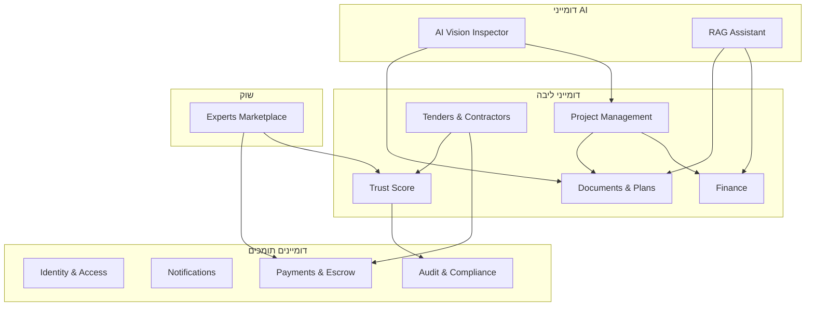
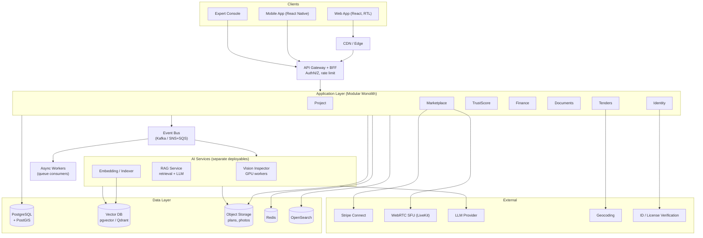
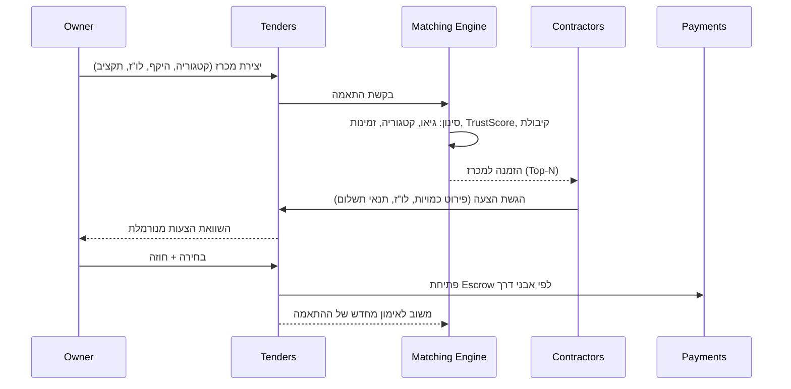
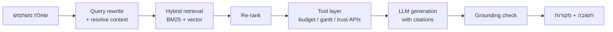
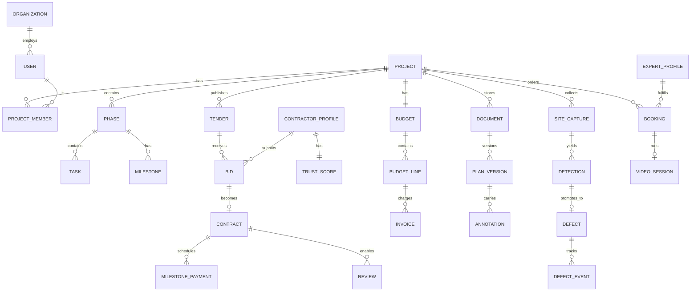

```mermaid
graph LR
    A["Photo upload<br/>(mobile, offline queue)"] --> B["Ingest<br/>EXIF, geo, timestamp"]
    B --> C["Quality gate<br/>blur / lighting / duplicate"]
    C --> D["Localization<br/>which room / plan area"]
    D --> E["Detection<br/>defects, hazards, elements"]
    E --> F["Plan comparison<br/>as-built vs as-designed"]
    F --> G["Severity + cost estimate"]
    G --> H["Draft report<br/>status = suggested"]
    H --> I["Human review<br/>owner / inspector"]
    I --> J["Defect issue<br/>tracked to closure"]
```

# BuildGuard — מסמך תכנון ברמה גבוהה (High Level Design)

| | |
|---|---|
| **גרסה** | 0.1 (טיוטה ראשונה) |
| **תאריך** | 2026-08-07 |
| **סטטוס** | לסקירה |
| **קהל יעד** | הנהלה, ארכיטקטורה, מוצר, פיתוח |

---

## 1. תקציר מנהלים

BuildGuard היא פלטפורמת SaaS לניהול ופיקוח על פרויקטי בנייה למגורים. המערכת מחברת שלושה צדדים —
**בעלי בתים/יזמים פרטיים**, **קבלנים ובעלי מקצוע**, ו**מפקחים ויועצים מוסמכים** — סביב פרויקט בנייה יחיד
המשמש כישות המרכזית במערכת.

הבידול המרכזי הוא **שכבת ה-AI**: "מפקח ממוחשב" מבוסס ראייה ממוחשבת שמשווה תמונות מהשטח מול התוכניות
האדריכליות, מזהה ליקויים, סטיות ומפגעי בטיחות, ומפיק דוח עם דירוג חומרה ואומדן עלות תיקון. לצדו פועל
צ'אטבוט RAG שעונה על שאלות מתוך המסמכים של הפרויקט הספציפי (חוזים, תוכניות, חשבוניות).

המסמך מגדיר את פירוק הדומיינים, הארכיטקטורה הלוגית והפיזית, מודל הנתונים, זרימות המפתח,
הדרישות הלא-פונקציונליות, ומפת דרכים בשלבים.

---

## 2. מטרות ולא-מטרות

### 2.1 מטרות מוצריות

| # | מטרה | מדד הצלחה (KPI) |
|---|---|---|
| G1 | לתת לבעל הבית שליטה אמיתית בתקציב ובלו"ז ללא ידע מקצועי | ירידה בחריגת תקציב ממוצעת בפרויקט |
| G2 | להחליף "המלצות מפה לאוזן" בבחירת קבלן מבוססת נתונים | % פרויקטים שבהם הקבלן נבחר דרך המכרז במערכת |
| G3 | לספק פיקוח רציף בעלות נמוכה | מס' ליקויים שזוהו ע"י AI ואומתו ע"י מפקח אנושי |
| G4 | לייצר אמון שקשה לזייף | % ביקורות מאומתות (חוזה + אבן דרך) מתוך סך הביקורות |
| G5 | ליצור שוק שירותים דו-צדדי רווחי | GMV ב-Marketplace, take-rate |

### 2.2 מטרות טכניות

* **Multi-tenant** מאובטח — בידוד נתונים ברמת הפרויקט והארגון.
* **Modular monolith → Services**: התחלה כמונוליט מודולרי עם גבולות דומיין חדים, המאפשר חילוץ שירותים בהמשך.
* **AI כשירות מבודד** — יכולת להחליף מודלים/ספקים ללא שינוי בליבה העסקית.
* **Mobile-first לשטח** — העלאת תמונות ועבודה offline-tolerant מהאתר.
* **RTL-first** — עברית כשפת ברירת מחדל, עם תשתית i18n מלאה.

### 2.3 לא-מטרות (בשלב זה)

* אין ניהול שכר/נוכחות עובדים של הקבלן.
* אין תכנון/עריכת CAD — צפייה, מדידה והערות בלבד.
* אין החלפת אישור קונסטרוקטור חוקי — פלט ה-AI הוא **המלצה**, לא אישור הנדסי.
* אין תמיכה בפרויקטים תעשייתיים/תשתיות בגרסה הראשונה (מגורים בלבד).

---

## 3. משתמשים ותרחישי מפתח

### 3.1 פרסונות

| פרסונה | מוטיבציה | כאב עיקרי | תדירות שימוש |
|---|---|---|---|
| **בעל בית / יזם פרטי** | לבנות בתקציב ובזמן | חוסר ידע מקצועי, חוסר שקיפות | יומי |
| **קבלן / בעל מקצוע** | להשיג עבודות איכותיות | תחרות על מחיר בלבד, תזרים | יומי בזמן ביצוע |
| **מפקח / מהנדס** | להשלים הכנסה בייעוץ ממוקד | נסיעות מיותרות לאתר | לפי דרישה |
| **מנהל פלטפורמה** | איכות השוק, מניעת הונאות | ביקורות מזויפות, סכסוכים | יומי |

### 3.2 תרחישי מפתח (User Journeys)

1. **הקמת פרויקט**: בעל בית מגדיר פרויקט → מעלה תוכניות → המערכת מציעה ציר זמן שלבי ותקציב בסיס לפי סוג/גודל.
2. **מכרז ובחירה**: פרסום חבילת עבודה → התאמה אלגוריתמית לקבלנים → הצעות → השוואה → חוזה → Escrow.
3. **פיקוח שוטף**: הקבלן/בעל הבית מעלה תמונות מהשטח → Vision Inspector מנתח → ליקוי נפתח כ-Issue → הקצאה ומעקב עד סגירה.
4. **שאלה פיננסית**: בעל הבית שואל בצ'אט "כמה רזרבה נשארה אם האינסטלטור חורג ב-12%?" → RAG שולף מהחוזה, מהחשבוניות ומהתקציב → תשובה עם ציטוט מקורות.
5. **ייעוץ לפי דרישה**: הזמנת מפקח מה-Marketplace → שיחת וידאו עם סימון על מסך → דוח חתום → תשלום משוחרר מה-Escrow.
6. **סגירת אבן דרך**: אישור אבן דרך מאומתת → שחרור תשלום → נפתח חלון לביקורת מאומתת → עדכון Trust Score.

---

## 4. פירוק לדומיינים (Domain Decomposition)

המערכת מפורקת ל-8 דומיינים עסקיים + 4 דומיינים תומכים. כל דומיין הוא **Bounded Context** בעל
מודל נתונים משלו, API משלו ואירועים (events) שהוא מפרסם.



### 4.1 טבלת דומיינים

| דומיין | אחריות | ישויות מרכזיות | אירועים שמפורסמים |
|---|---|---|---|
| **Project Management** | ציר זמן שלבי (יסודות → שלד → גמר), % התקדמות, גאנט עם נתיב קריטי, אבני דרך | `Project`, `Phase`, `Task`, `Milestone`, `Dependency` | `MilestoneCompleted`, `TaskDelayed`, `PhaseStarted` |
| **Tenders & Contractors** | קטגוריות עבודה, התאמה גיאוגרפית-אלגוריתמית, פרופילים מאומתים, הצעות מחיר | `Tender`, `Bid`, `WorkCategory`, `ContractorProfile`, `Contract` | `TenderPublished`, `BidSubmitted`, `ContractSigned` |
| **Trust Score** | חישוב ציון משוקלל, זיהוי ביקורות מזויפות, שקיפות רכיבי הציון | `TrustScore`, `ScoreComponent`, `Review`, `Dispute` | `ScoreRecalculated`, `ReviewFlagged` |
| **Finance** | תקציב רב-מטבעי, תחזית תזרים, התראות Burn-Rate, ספר חשבוניות | `Budget`, `BudgetLine`, `Invoice`, `Payment`, `CashflowForecast` | `BudgetThresholdBreached`, `InvoiceApproved` |
| **Documents & Plans** | צפייה ב-CAD/PDF בדפדפן, מדידות על התוכנית, שכבות, השוואת גרסאות | `Document`, `PlanVersion`, `Layer`, `Annotation`, `Measurement` | `PlanVersionUploaded`, `AnnotationAdded` |
| **AI Vision Inspector** | תמונה → זיהוי ליקוי → השוואה לתוכנית → דוח חומרה + אומדן עלות | `SiteCapture`, `Detection`, `Defect`, `InspectionReport` | `DefectDetected`, `SafetyHazardDetected` |
| **RAG Assistant** | Q&A מעוגן במסמכי הפרויקט הספציפי | `KnowledgeChunk`, `Embedding`, `Conversation`, `Citation` | `AnswerGenerated` |
| **Experts Marketplace** | הזמנת מפקח/מהנדס, וידאו WebRTC עם סימון מסך, סליקה + Escrow | `ExpertProfile`, `ServiceOffering`, `Booking`, `VideoSession` | `BookingConfirmed`, `SessionCompleted` |
| **Identity & Access** | הרשמה, אימות זהות/רישיון, תפקידים והרשאות ברמת פרויקט | `User`, `Organization`, `Membership`, `Role`, `Verification` | `UserVerified` |
| **Notifications** | Push/Email/SMS/WhatsApp, העדפות, digest | `NotificationTemplate`, `Subscription`, `Delivery` | — |
| **Payments & Escrow** | Stripe Connect, נאמנות, שחרור מותנה אבן דרך, החזרים | `EscrowAccount`, `Payout`, `Refund` | `FundsReleased`, `PayoutFailed` |
| **Audit & Compliance** | לוג בלתי-ניתן-לשינוי לפעולות רגישות, שמירת ראיות לסכסוכים | `AuditEntry`, `EvidenceBundle` | — |

---

## 5. ארכיטקטורה ברמה גבוהה

### 5.1 תרשים מערכת



### 5.2 עקרונות ארכיטקטוניים

1. **Modular Monolith תחילה.** גבולות דומיין נאכפים בקוד (מודולים, ללא import חוצה-דומיין מלבד דרך חוזי API/אירועים). שירותי ה-AI מופרדים מהיום הראשון בגלל פרופיל משאבים שונה (GPU, latency, scaling).
2. **Event-Driven בין דומיינים.** דומיין לא קורא ישירות ל-DB של דומיין אחר. שינויים מתפרסמים כאירועים (Outbox Pattern) ומעודכנים ב-read models.
3. **CQRS ממוקד.** גאנט, דשבורד ותחזית תזרים נבנים כ-read models מחושבים מראש, לא כשאילתות כבדות בזמן אמת.
4. **AI כ-Advisory Layer.** פלט AI תמיד עובר לסטטוס `suggested` ודורש אישור אנושי לפני שהוא משנה מצב עסקי (פתיחת ליקוי רשמי, עצירת תשלום).
5. **Storage-first למדיה.** תמונות ותוכניות עולות ישירות ל-Object Storage דרך presigned URL; ה-API מקבל metadata בלבד.
6. **Idempotency בכל פעולה כספית.** מפתח אידמפוטנטיות חובה בכל קריאה שמזיזה כסף.

### 5.3 מחסנית טכנולוגית מוצעת

| שכבה | בחירה | נימוק |
|---|---|---|
| Frontend Web | React + TypeScript, Vite, TanStack Query | אקוסיסטם עשיר, תמיכת RTL טובה |
| Mobile | React Native | שיתוף לוגיקה עם ה-Web, מצלמה + offline queue |
| Backend | Node.js (NestJS) או Python (FastAPI) | NestJS למודולריות; Python אם צוות ה-AI דומיננטי |
| DB ראשי | PostgreSQL 16 + PostGIS | עסקאות חזקות, גיאו להתאמת קבלנים |
| Vector | pgvector (MVP) → Qdrant (scale) | פשטות תפעולית תחילה |
| Object Storage | S3 / GCS | תוכניות ותמונות, lifecycle לארכיון |
| Queue/Bus | SQS + SNS (MVP) → Kafka | עלות נמוכה בהתחלה |
| Search | OpenSearch | חיפוש קבלנים, מסמכים, חשבוניות |
| Video | LiveKit (SFU) | הקלטה, סימון על מסך, סקייל |
| תשלומים | Stripe Connect + Escrow ידני | KYC ותשלומים לצד ג' |
| AI Vision | מודל detection/segmentation מותאם + VLM | ראה §7 |
| Observability | OpenTelemetry, Grafana, Sentry | traces חוצי-שירות |

---

## 6. פירוט דומיינים מרכזיים

### 6.1 ניהול פרויקט

**מודל.** `Project` → `Phase[]` (יסודות, שלד, מעטפת, מערכות, גמר) → `Task[]` → `Milestone[]`.
תלויות בין משימות (`FS`, `SS`, `FF`, `SF`) מאפשרות חישוב **נתיב קריטי (CPM)**.

**חישוב התקדמות.** % ההתקדמות אינו מוזן ידנית בלבד — הוא משוקלל משלושה מקורות:

```
progress(phase) = 0.5 · weighted_task_completion
                + 0.3 · verified_milestones_ratio      // אושרו ע"י אבן דרך מאומתת
                + 0.2 · ai_visual_progress_estimate     // הערכת Vision Inspector
```

הרכיב השלישי הוא **advisory** ומוצג בנפרד עם רמת ביטחון, כדי למנוע "ניפוח" התקדמות.

**נתיב קריטי.** מחושב ב-worker אסינכרוני בכל שינוי משימה, נשמר כ-read model
(`gantt_snapshot`), ומשודר ל-UI ב-WebSocket. שינוי בנתיב הקריטי מייצר התראה
לבעל הבית ולקבלן הרלוונטי.

**Templates.** ספריית תבניות פרויקט לפי סוג (וילה חד-משפחתית, דו-משפחתי, תוספת בנייה)
מייצרת ציר זמן ותקציב התחלתי — מוריד את חסם הכניסה למשתמש הלא-מקצועי.

### 6.2 מכרזים וקבלנים

**זרימה.**



**מנוע התאמה.** ניקוד מרובה-קריטריונים:

```
match_score = 0.30 · geo_proximity_decay(distance)
            + 0.25 · trust_score_normalized
            + 0.20 · category_specialization
            + 0.15 · availability_fit(timeline)
            + 0.10 · project_size_experience
```

`geo_proximity_decay` הוא דעיכה אקספוננציאלית לפי זמן נסיעה (לא מרחק אווירי), מחושב ב-PostGIS
עם isochrones. סף מינימלי של Trust Score נדרש כדי להופיע בכלל.

**פרופיל מאומת.** אימות רב-שכבתי: ח.פ./עוסק, רישיון קבלן (מול פנקס הקבלנים), ביטוח בתוקף
(עם תאריך תפוגה ותזכורת), אימות זהות. פרופיל לא מאומת מסומן ויזואלית ומקבל תקרת חשיפה.

### 6.3 Trust Score

**נוסחת הציון.**

| רכיב | משקל | מקור הנתונים |
|---|---|---|
| עמידה בזמנים | 20% | סטייה בפועל מול לו"ז חוזי, לפי אבני דרך מאומתות |
| איכות ביצוע | 25% | ליקויים שאומתו (Vision + מפקח), שיעור תיקון חוזר |
| שקיפות פיננסית | 20% | חשבוניות בזמן, סטייה מהצעת המחיר, תוספות לא מתועדות |
| סכסוכים | 15% | מס' סכסוכים, חומרה, תוצאה |
| שירות | 10% | זמן תגובה, ביקורות מאומתות |
| ותק וניסיון | 10% | מס' פרויקטים שהושלמו, שנים, היקף |

**חישוב.**

```
raw   = Σ (wᵢ · componentᵢ)
score = raw · confidence(n)          // דעיכת בייס עבור מדגם קטן
confidence(n) = n / (n + k)          // k ≈ 5 פרויקטים
```

* **Time decay:** משקל יורד אקספוננציאלית לפרויקטים ישנים (half-life ≈ 18 חודשים).
* **מניעת פיצול:** זהות מקושרת לח.פ. + בעלים; פתיחת ישות חדשה לא מאפסת היסטוריה.
* **שקיפות:** לקבלן מוצג פירוט מלא של הרכיבים ומה משפר כל אחד; ערעור אפשרי דרך תהליך Dispute.

**זיהוי ביקורות מזויפות.** הגנה בשלוש שכבות:

1. **חסם מבני (העיקרי):** ביקורת אפשרית **רק** ממשתמש שחתם חוזה במערכת **ו**סיים אבן דרך מאומתת. זה מייקר הונאה בעלות אמיתית.
2. **זיהוי אנומליות:** גרף קשרים (מכשיר, IP, אמצעי תשלום, דפוסי עבודה) לאיתור טבעות; ניתוח התפלגות זמן/ציונים; פערים בין הביקורת לנתונים האובייקטיביים (למשל 5 כוכבים על פרויקט עם 40% חריגת לו"ז).
3. **סקירה אנושית:** ביקורת שמסומנת מעל סף מגיעה ל-Trust & Safety לפני שהיא משפיעה על הציון.

### 6.4 כספים

* **תקציב היררכי:** `Budget` → `BudgetLine` (לפי שלב/קטגוריה) → `Commitment` (חוזה) → `Actual` (חשבונית משולמת).
* **רב-מטבעיות:** כל סכום נשמר כ-`(amount_minor, currency, fx_rate, fx_date)`. תצוגה במטבע הצגה נבחר; **חישובי אמת תמיד במטבע המקור**. אין עיגול ביניים — מספרים שלמים ביחידות מינור.
* **תחזית תזרים:** מחושבת מהגאנט × תנאי התשלום בחוזים; מעודכנת בכל `TaskDelayed` / `InvoiceApproved`.
* **התראות Burn-Rate:**

```
burn_rate = actual_spend / progress_percent
alert if burn_rate > baseline · (1 + tolerance)
```
עם התראה מדורגת (מידע → אזהרה → קריטית) וחיזוי "בקצב הזה תחרוג ב-X ש״ח עד סיום".

* **ספר חשבוניות:** OCR לחשבונית → הצעת שיוך לשורת תקציב → אישור → כתיבה לספר. כל רשומה בלתי ניתנת לעריכה (תיקון = רשומת נגד).

### 6.5 מסמכים ותוכניות

| יכולת | מימוש |
|---|---|
| צפייה ב-PDF | PDF.js בדפדפן |
| צפייה ב-CAD (DWG/DXF/IFC) | המרה בצד השרת ל-tiles וקטוריים + מודל geometry; viewer מבוסס WebGL |
| מדידות על התוכנית | כיול קנה מידה פר-תוכנית; מדידת אורך/שטח/זווית, נשמרת כישות `Measurement` |
| שכבות | מיפוי layers מקוריים לקטגוריות (חשמל, אינסטלציה, קונסטרוקציה) עם toggle |
| השוואת גרסאות | diff ויזואלי: overlay עם onion-skin + הדגשת אזורי שינוי (raster diff על ה-tiles, semantic diff על ה-geometry) |

**עיבוד אסינכרוני:** העלאה → תור → המרה/tiling/חילוץ טקסט → אינדוקס ל-RAG → פרסום `PlanVersionUploaded`.
עד לסיום, המסמך במצב `processing` ב-UI.

**גרסאות:** תוכניות הן append-only. כל גרסה שומרת מי העלה, מתי, ומה השתנה. ליקוי או מדידה
תמיד מקושרים ל-**גרסה ספציפית**, כדי שדוח ישן יישאר קריא ונכון.

### 6.6 Marketplace מומחים

* **פרופיל מומחה:** התמחות, רישיון (מאומת מול הרשם), אזורי שירות, תעריף, זמינות (יומן).
* **הזמנה:** בחירת שירות (ייעוץ וידאו / ביקור באתר / בדיקת תוכניות) → slot → תשלום נכנס ל-Escrow.
* **שיחת וידאו:** WebRTC דרך SFU. יכולות: שיתוף מצלמת טלפון מהשטח, **סימון על מסך בזמן אמת** (annotation layer משודר כאירועים, לא כווידאו), הקלטה בהסכמה, snapshot ישירות לתיק הליקויים.
* **סליקה:** Stripe Connect — המומחה הוא Connected Account. הכספים משוחררים לאחר אישור סיום השיחה + חלון ערעור. עמלת פלטפורמה נגבית כ-application fee.

---

## 7. שכבת ה-AI

### 7.1 AI Vision Inspector — צינור עיבוד



**שלבים מרכזיים:**

| שלב | טכניקה | הערות |
|---|---|---|
| Quality gate | מודל קל (blur/exposure), pHash לכפילויות | חוסך עלות GPU ומונע דוחות רועשים |
| Localization | סריקת QR/תג חדר + גיאו + ניחוש VLM | קישור התמונה לאזור בתוכנית — **התנאי לכל השוואה** |
| Detection | מודל detection/segmentation מאומן על דאטהסט בנייה (סדקים, רטיבות, ריתוך/זיון חשוף, אי-אנכיות, בטיחות: קסדה, מעקה, פיגום) | ensemble עם VLM לתיאור טקסטואלי |
| Plan comparison | חילוץ מידות מהתמונה (עם reference scale) מול geometry מהתוכנית | מזהה: פתח חסר/עודף, מיקום שגוי, סטייה במידה מעבר לסבולת |
| Severity | דירוג 1–5 לפי: סיכון בטיחותי, השפעה מבנית, עלות תיקון עתידית, דחיפות (שלב בנייה) | מפגע בטיחות = עוקף לדחיפות מיידית |
| Cost estimate | טבלת מחירונים לפי סוג ליקוי × אזור × היקף, מוצג כטווח | תמיד טווח עם רמת ביטחון, לעולם לא מספר יחיד |

**עקרונות בטיחות ואמון:**

* פלט תמיד `suggested` — לא נפתח ליקוי רשמי ולא נעצר תשלום ללא אישור אנושי.
* כל זיהוי מלווה ב-**רמת ביטחון** ובחיתוך התמונה (bounding box) לאימות ויזואלי מהיר.
* מתחת לסף ביטחון → מוצע "לשלוח למפקח" (hook טבעי ל-Marketplace).
* **Human-in-the-loop feedback**: כל אישור/דחייה נשמר כתווית לאימון מחדש. מודדים precision/recall לפי סוג ליקוי, עם דגש על **recall גבוה למפגעי בטיחות** (עדיף התראת שווא).
* **הצהרה משפטית מפורשת:** אינו תחליף לבדיקה הנדסית מוסמכת.

### 7.2 צ'אטבוט RAG

**היקף הידע (per-project):** חוזים, כתבי כמויות, תוכניות (טקסט + metadata), חשבוניות וקבלות,
דוחות ליקויים, יומן אתר, התכתבויות רלוונטיות, מצב תקציב וגאנט **חי**.

**ארכיטקטורה:**



**נקודות מפתח:**

* **Retrieval היברידי** — שמות ומספרים (מק"ט, סעיף בחוזה) נמצאים ב-BM25, כוונה סמנטית ב-vector.
* **Tool use ולא רק retrieval.** שאלה כמו *"כמה רזרבה נשארה אם האינסטלטור חורג ב-12%?"* אינה שאלת אחזור — היא **חישוב**. הצ'אטבוט קורא ל-API של Finance (`simulateOverrun(vendor, pct)`) ומחזיר מספר מחושב, לא מנוחש. זהו עיקרון מחייב: **מספרים באים מה-API, לא מה-LLM**.
* **בידוד Tenant מוחלט.** ה-namespace ב-Vector DB הוא `project_id`, והסינון נאכף בשכבת השירות (לא בפרומפט). בנוסף, סינון לפי הרשאות המשתמש — קבלן לא רואה חוזים של קבלן אחר באותו פרויקט.
* **ציטוטים חובה.** כל טענה עובדתית מקושרת למסמך ולעמוד/סעיף. ללא מקור → "אין לי מידע על כך בפרויקט".
* **טריות:** אינדוקס מחדש מיידי (event-driven) על כל שינוי מסמך; נתונים חיים (תקציב, גאנט) תמיד דרך tools ולא דרך אינדקס.

### 7.3 עלות ובקרת AI

* Cache על embeddings ועל תשובות חוזרות.
* ניתוב מודלים: מודל קל למשימות פשוטות (סיווג, quality gate), מודל חזק להסקה מורכבת.
* מכסות פר-tenant עם תצוגת שימוש, ותמחור מדורג לפי נפח ניתוחי Vision.
* אבסטרקציית ספק (adapter) כדי לאפשר החלפת LLM/VLM ללא שינוי בליבה.

---

## 8. מודל נתונים — ישויות ליבה



**החלטות מודל מרכזיות:**

* **`Project` הוא גבול הבידוד.** כל שאילתה נושאת `project_id`; נאכף ב-Row Level Security ב-Postgres כרשת ביטחון שנייה.
* **`Detection` ≠ `Defect`.** Detection הוא פלט AI גולמי; Defect הוא ישות עסקית מאושרת עם אחריות ותאריך יעד. ההפרדה הזו היא הבסיס ל-human-in-the-loop.
* **כסף כמספר שלם.** `amount_minor BIGINT` + `currency CHAR(3)`. לעולם לא float.
* **Append-only לישויות רגישות.** חשבוניות, ביקורות, גרסאות תוכנית, אירועי ליקוי — תיקון הוא רשומה חדשה, לא UPDATE.

---

## 9. נושאים חוצי-מערכת

### 9.1 הרשאות (AuthZ)

מודל **RBAC ברמת פרויקט + ABAC לתנאים**:

| תפקיד | תקציב | תוכניות | מכרזים | ליקויים |
|---|---|---|---|---|
| Owner | מלא | מלא | מלא | מלא |
| Project Manager | קריאה + הצעה | מלא | מלא | מלא |
| Contractor | **רק החוזה שלו** | לפי הקצאה | הצעות שלו | שלו |
| Inspector | קריאה | קריאה + הערות | — | יצירה + אימות |
| Viewer (בן משפחה, בנק) | קריאה מוגבלת | קריאה | — | קריאה |

הרשאה נבדקת בשכבת השירות (policy engine מרכזי, למשל OPA/Cedar), **לא ב-UI בלבד**.

### 9.2 אבטחה ופרטיות

* הצפנה במנוחה ובתעבורה; מפתחות ב-KMS.
* Presigned URLs קצרי-מועד לכל מדיה; אין bucket ציבורי.
* PII ממופה ומסווג; מחיקה/ייצוא לפי GDPR ולפי חוק הגנת הפרטיות הישראלי.
* תמונות שטח עשויות להכיל אנשים → טשטוש פנים אוטומטי כברירת מחדל בתמונות שמשותפות מחוץ לפרויקט.
* Audit log בלתי-ניתן-לשינוי לפעולות כספיות, שינויי הרשאות, ואישור/דחיית ממצאי AI.
* בדיקות חדירה ותוכנית תגובה לאירועים לפני GA.

### 9.3 שפה ונגישות

* **RTL-first**: לוגי CSS properties (`inline-start/end`), בדיקות snapshot ב-RTL וב-LTR.
* i18n מלא: עברית (ברירת מחדל), ערבית, רוסית, אנגלית — קהלים ריאליים בשוק הבנייה הישראלי.
* מונחים מקצועיים: מילון מונחים מנוהל, כדי שהצ'אטבוט וה-UI ידברו באותה שפה.
* נגישות WCAG 2.1 AA — רלוונטי גם רגולטורית (תקן ישראלי 5568).

### 9.4 עבודה מהשטח (Offline)

אתרי בנייה = קליטה גרועה. האפליקציה הניידת:
* מתעדת תמונות והערות ל-**תור מקומי** ומסנכרנת כשיש רשת.
* שומרת תוכניות שהורדו ל-cache לצפייה offline.
* פותרת קונפליקטים לפי last-write-wins על metadata, אך **לעולם לא מאבדת מדיה** (הכל נשמר, כפילויות מסומנות).

### 9.5 תצפיתיות (Observability)

* Traces חוצי-שירות (בקשה → AI → DB) עם OpenTelemetry.
* מדדי מוצר: זמן-לתובנה, % ממצאי AI שאושרו, דיוק תחזית תקציב.
* מדדי AI ייעודיים: precision/recall לפי סוג ליקוי, שיעור hallucination ב-RAG (מדגם מבוקר), latency P95.
* Alerting על: תור עיבוד תמונות שנתקע, כשלי Stripe payout, ירידה בדיוק המודל.

---

## 10. דרישות לא-פונקציונליות

| קטגוריה | יעד |
|---|---|
| זמינות | 99.9% לשירותי ליבה; 99.5% לשירותי AI |
| Latency | API P95 < 300ms; טעינת תוכנית ראשונית < 3s; ניתוח תמונה < 60s (אסינכרוני) |
| סקייל (שנה 1) | 5,000 פרויקטים פעילים, 50,000 משתמשים, 2M תמונות |
| גודל מסמך | עד 500MB לקובץ CAD, עד 25MB לתמונה |
| RPO / RTO | RPO 15 דקות, RTO 4 שעות |
| שמירת נתונים | 7 שנים לרשומות פיננסיות וחוזיות (דרישה משפטית) |
| ריבוי מכשירים | Web (Chrome/Safari/Edge), iOS 15+, Android 10+ |

---

## 11. מפת דרכים בשלבים

### שלב 1 — MVP (חודשים 0–4): "שקיפות"
ניהול פרויקט (ציר זמן, אבני דרך, גאנט בסיסי) · תקציב וספר חשבוניות · העלאה וצפייה ב-PDF · הרשאות ותפקידים · אפליקציית שטח לתמונות · התראות.
**מטרה:** בעל בית רואה את מצב הפרויקט האמיתי במקום אחד.

### שלב 2 — (חודשים 4–8): "אמון"
מכרזים ומנוע התאמה · פרופילים מאומתים · Trust Score v1 · ביקורות מאומתות · חוזים ואבני דרך תשלום · Escrow ב-Stripe Connect.
**מטרה:** אפשר למצוא ולסגור קבלן דרך הפלטפורמה בבטחה.

### שלב 3 — (חודשים 8–14): "אינטליגנציה"
Vision Inspector v1 (בטיחות + ליקויים נפוצים) · צ'אטבוט RAG · viewer ל-CAD עם שכבות ומדידות · השוואת גרסאות · תחזית תזרים והתראות Burn-Rate.
**מטרה:** הבידול המרכזי חי בידי משתמשים.

### שלב 4 — (חודשים 14+): "שוק"
Marketplace מומחים · וידאו WebRTC עם סימון מסך · Vision v2 (השוואה מלאה לתוכנית + אומדני עלות) · Trust Score v2 עם זיהוי הונאות מתקדם · API לשותפים (בנקים, חברות ביטוח).

**עקרון:** כל שלב חייב להיות בעל ערך עצמאי — לא לחכות לשלב 3 כדי לספק ערך.

---

## 12. סיכונים והנחות

| # | סיכון | השפעה | מיטיגציה |
|---|---|---|---|
| R1 | **דאטה לאימון Vision** — אין דאטהסט ליקויי בנייה מתויג בקנה מידה | גבוהה | התחלה עם בטיחות (דאטה זמין יותר) + תיוג בשירות עצמי מהפרויקטים הראשונים + שותפות עם חברת פיקוח |
| R2 | **Cold start דו-צדדי** — אין קבלנים בלי בעלי בתים ולהיפך | גבוהה | גיוס ידני של קבלנים אזוריים, שלב 1 כשימושי גם ללא קבלנים |
| R3 | **חשיפה משפטית** מהמלצת AI שגויה | גבוהה | פלט advisory בלבד, אישור אנושי, הצהרות ברורות, ביטוח אחריות מקצועית |
| R4 | **התנגדות קבלנים ל-Trust Score** | בינונית | שקיפות מלאה ברכיבים, מסלול ערעור, הצגת הציון כמנוע לידים ולא כענישה |
| R5 | **מורכבות CAD** — פורמטים, גרסאות, קבצים כבדים | בינונית | להתחיל ב-PDF בלבד; CAD בשלב 3 עם ספריית המרה מסחרית |
| R6 | **עלויות AI** לא צפויות | בינונית | quality gate לפני GPU, ניתוב מודלים, מכסות ותמחור מדורג |
| R7 | **הונאת Escrow / סכסוכים** | בינונית | תהליך Dispute מוגדר, ראיות מתועדות (EvidenceBundle), בוררות צד ג' |

**הנחות פתוחות לאימות:**
* השוק הישראלי — האם יש גישה תכנותית לפנקס הקבלנים לאימות רישיון?
* האם בעלי בתים מוכנים לשלם subscription, או שהמודל צריך להיות take-rate על עסקאות?
* רגולציה על החזקת כספי נאמנות — האם נדרש רישיון, או שספק הסליקה מכסה זאת?

---

## 13. שאלות פתוחות להחלטה

1. **מודל הכנסה:** מנוי לבעל בית / עמלה מהקבלן / take-rate ב-Marketplace / היברידי?
2. **תמחור AI:** כלול במנוי או pay-per-inspection?
3. **בעלות על הדאטה:** מי הבעלים של תמונות השטח והדוחות — בעל הבית, הקבלן, או משותף? (השלכות על אימון מודלים)
4. **גבול גיאוגרפי לשנה 1** — ישראל בלבד או גם שוק נוסף? (משפיע על אימות רישיונות, מטבע, שפה)
5. **בחירת שפת Backend** — NestJS מול FastAPI, לפי הרכב הצוות.

---

## נספח א' — מילון מונחים

| מונח | הגדרה |
|---|---|
| **אבן דרך מאומתת** | אבן דרך שאושרה בראיות (תמונות + אישור צד שני או מפקח), ומשמשת כטריגר לתשלום ולביקורת |
| **Trust Score** | ציון 0–100 משוקלל המשקף אמינות קבלן, ראה §6.3 |
| **Detection** | ממצא AI גולמי, לפני אישור אנושי |
| **Defect (ליקוי)** | ממצא מאושר שהפך למשימה עם אחראי ותאריך יעד |
| **Escrow** | כספים המוחזקים בנאמנות ומשוחררים באישור אבן דרך |
| **Burn Rate** | קצב שריפת תקציב יחסית לקצב ההתקדמות |
| **CPM** | Critical Path Method — חישוב הנתיב הקריטי בלו"ז |
| **Grounding** | עיגון תשובת LLM במקורות מאומתים מהפרויקט |
